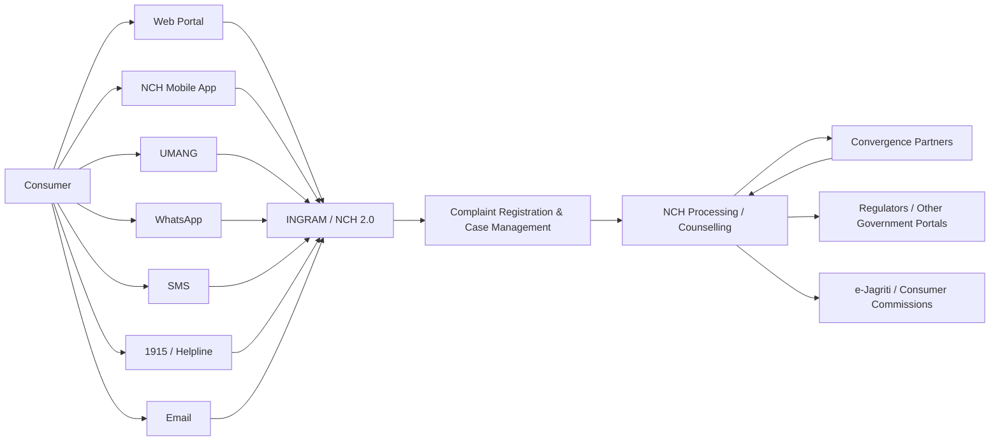
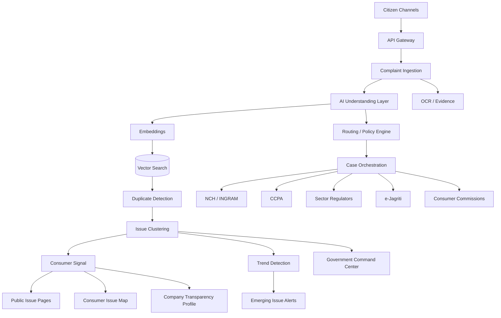
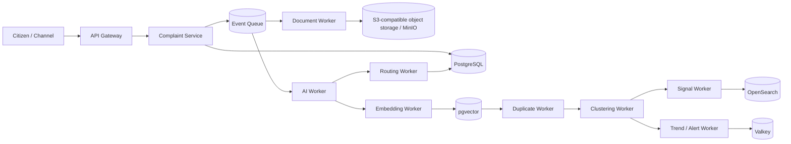
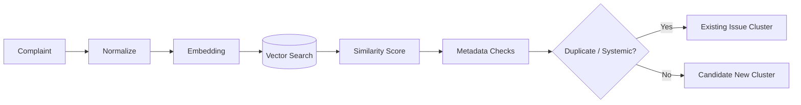
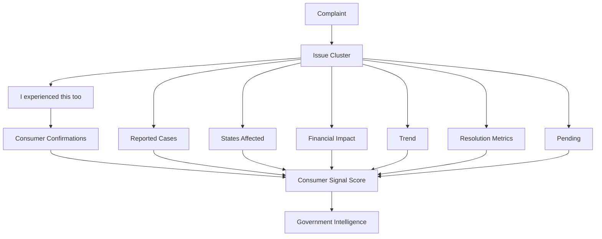
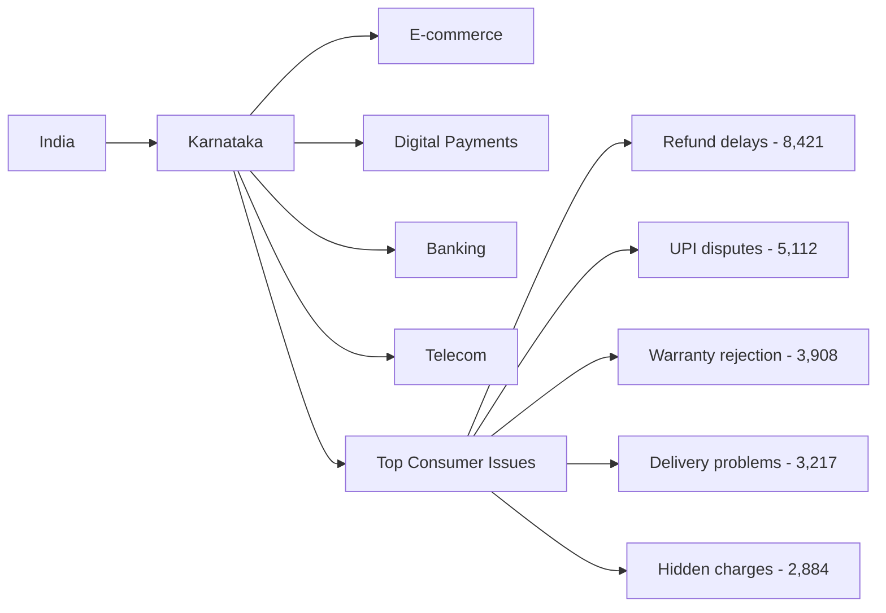
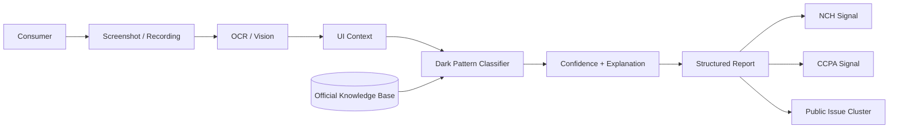
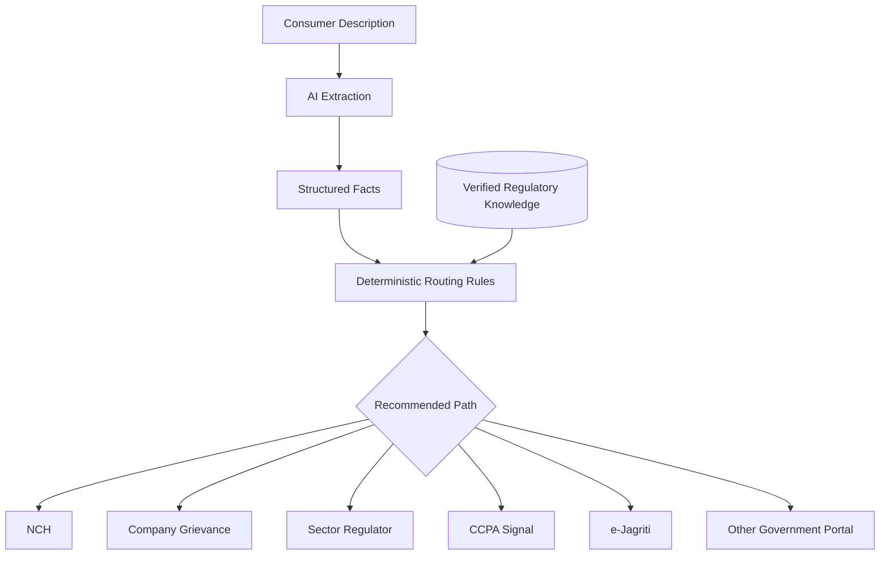
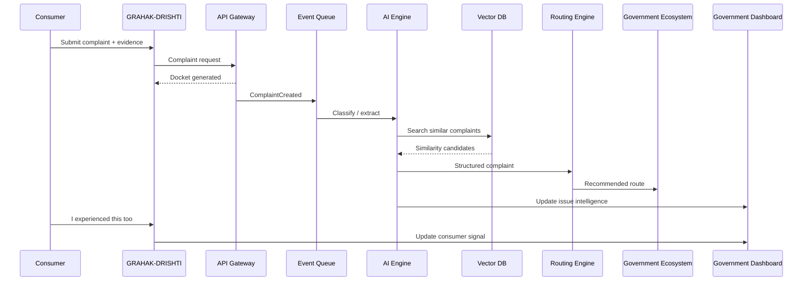
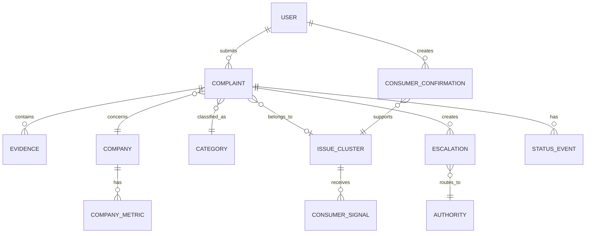

# GRAHAK-DRISHTI
## Consumer Protection Intelligence & Escalation Platform

**Tagline:** From Individual Complaints to Consumer Intelligence  
**Product tagline:** See patterns. Route smarter. Resolve faster.

**Updated hackathon stack:** Next.js + JavaScript + Tailwind + FastAPI + PostgreSQL/pgvector + Valkey + OpenSearch + MinIO + Kafka + Docker Compose.

---

## Table of Contents

1. [GRAHAK-DRISHTI - meaning and identity](#grahak-drishti---meaning-and-identity)
2. [What NCH 2.0 actually looks like today](#what-nch-20-actually-looks-like-today)
3. [What we actually know about the current NCH architecture](#what-we-actually-know-about-the-current-nch-architecture)
4. [Current NCH 2.0 - observable architecture](#current-nch-20---observable-architecture)
5. [What NCH is already doing well](#what-nch-is-already-doing-well)
6. [Where the real opportunity exists](#where-the-real-opportunity-exists)
7. [NCH is handling enormous volumes](#nch-is-handling-enormous-volumes)
8. [The question changes from "Can the backend handle traffic?"](#the-question-changes-from-"can-the-backend-handle-traffic")
9. [The core information-scalability questions](#the-core-information-scalability-questions)
10. [User / consumer problems](#user---consumer-problems)
11. [Government / system-level problems](#government---system-level-problems)
12. [Our selling point](#our-selling-point)
13. [Proposed architecture](#proposed-architecture)
14. [The most important architectural principle](#the-most-important-architectural-principle)
15. [Proposed event-driven architecture](#proposed-event-driven-architecture)
16. [Recommended technology stack](#recommended-technology-stack)
17. [Frontend and application structure](#frontend-and-application-structure)
18. [Primary database](#primary-database)
19. [Vector search](#vector-search)
20. [Duplicate Complaint Detection - killer feature](#duplicate-complaint-detection---killer-feature)
21. [Example of systemic clustering](#example-of-systemic-clustering)
22. [Consumer Signal - turn votes into evidence](#consumer-signal---turn-votes-into-evidence)
23. [Consumer Signal Score](#consumer-signal-score)
24. [Consumer Issue Map](#consumer-issue-map)
25. [Company Consumer Transparency Profile](#company-consumer-transparency-profile)
26. [Dark Patterns - mandatory feature](#dark-patterns---mandatory-feature)
27. [AI + Consumer Protection + Government + Data + Public Interest](#ai-+-consumer-protection-+-government-+-data-+-public-interest)
28. [Consumer Navigation Engine - "Where should I complain?"](#consumer-navigation-engine---"where-should-i-complain")
29. [Do not replace NCH or e-Jagriti](#do-not-replace-nch-or-e-jagriti)
30. [Four-layer MVP](#four-layer-mvp)
31. [Layer 1 - Consumer: report an issue](#layer-1---consumer-report-an-issue)
32. [Layer 2 - AI: structured extraction](#layer-2---ai-structured-extraction)
33. [Layer 3 - Consumer Network](#layer-3---consumer-network)
34. [Layer 4 - Government Intelligence Dashboard](#layer-4---government-intelligence-dashboard)
35. [Backend architecture as part of the pitch](#backend-architecture-as-part-of-the-pitch)
36. [Scalability technology components](#scalability-technology-components)
37. [Complaint timeline improvement](#complaint-timeline-improvement)
38. [Do not promise that votes force government action](#do-not-promise-that-votes-force-government-action)
39. [Privacy architecture](#privacy-architecture)
40. [Do not publicly expose individual accusations](#do-not-publicly-expose-individual-accusations)
41. [MVP scope - five exceptional experiences](#mvp-scope---five-exceptional-experiences)
42. [Why e-commerce is the right MVP vertical](#why-e-commerce-is-the-right-mvp-vertical)
43. [End-to-end system flow](#end-to-end-system-flow)
44. [Data model](#data-model)
45. [Recommended repository structure](#recommended-repository-structure)
46. [Development phases](#development-phases)
47. [Recommended demo scenarios](#recommended-demo-scenarios)
48. [Synthetic data strategy](#synthetic-data-strategy)
49. [Systemic clustering proof](#systemic-clustering-proof)
50. [Performance and non-functional requirements](#performance-and-non-functional-requirements)
51. [Evaluation metrics](#evaluation-metrics)
52. [RAG and official knowledge base](#rag-and-official-knowledge-base)
53. [System of record vs intelligence layer](#system-of-record-vs-intelligence-layer)
54. [Scaling strategy](#scaling-strategy)
55. [How to prove scalability](#how-to-prove-scalability)
56. [Hackathon MVP phase gates](#hackathon-mvp-phase-gates)
57. [End-to-end judge demo](#end-to-end-judge-demo)
58. [What judges should remember](#what-judges-should-remember)
59. [Final pitch](#final-pitch)

---

## 1. GRAHAK-DRISHTI - meaning and identity

Meaning

**Grahak** = Consumer / Customer
**Drishti** = Vision / Perspective / Insight

GRAHAK-DRISHTI = A consumer-centric view of India's marketplace.

It represents the idea that the government should not only receive individual complaints - it should be able to see the larger pattern behind them.

Primary tagline

**From Individual Complaints to Consumer Intelligence**

Product tagline

**See patterns. Route smarter. Resolve faster.**

One-sentence definition

**GRAHAK-DRISHTI is a citizen-facing intelligence and escalation layer across India's consumer-protection ecosystem.**

Pitch sentences

- We don't replace India's consumer-protection systems. We connect them.
- We don't just collect complaints. We understand what the complaints collectively mean.
- We transform complaint volume into actionable consumer intelligence.
- The problem is no longer only complaint registration. The problem is information scalability.
- One complaint is a case. Ten thousand similar complaints are a signal.
- GRAHAK-DRISHTI turns consumer noise into systemic intelligence.
- AI + Consumer Protection + Government + Data + Public Interest.

## 2. What NCH 2.0 actually looks like today

NCH 2.0 is not an obsolete government portal. The official NCH platform supports web, mobile app, UMANG, WhatsApp, SMS, email and telephone access, alongside consumer, company and regulator workflows, document upload and complaint tracking. It is positioned as the pre-litigation consumer grievance mechanism.

NCH has also introduced AI-related technologies such as speech recognition, multilingual chatbots and automated translation as part of its technology upgrades.

Therefore, the hackathon should not pitch an old-style redesign of NCH. The stronger position is: **NCH 2.0 solved access and digital registration; GRAHAK-DRISHTI solves the information-scalability problem created by that success.**

## 3. What we actually know about the current NCH architecture

The government does not publicly document the complete internal NCH 2.0 backend architecture as a public reference architecture. We can observe interfaces, workflows, public dashboards and published capabilities, but we should not claim that the internal platform uses any specific database, Kafka deployment, Kubernetes cluster, microservices topology, or other undocumented implementation.

For the hackathon, distinguish between:

**Documented current architecture** - based on public government material and observable workflows.

**Our proposed architecture** - the architecture GRAHAK-DRISHTI introduces to solve the identified information-scalability problem.

## 4. Current NCH 2.0 - observable architecture

The observable high-level workflow is represented below. This is a capability/workflow diagram, not a claim about undocumented internal implementation.




## 5. What NCH is already doing well

- Access: consumers can use multiple channels.
- Language: NCH supports 17 languages.
- Pre-litigation resolution: NCH provides a mechanism for attempting resolution before formal dispute proceedings.
- Company convergence: companies can participate in the NCH Convergence Program and receive grievances.
- Tracking: consumers can track complaints using docket number and registered contact information, with CAPTCHA.
- Public visibility: NCH exposes public success stories and grievance-related information.

These strengths should be acknowledged in the pitch. The product is an evolution layer, not a claim that the existing system does nothing useful.

## 6. Where the real opportunity exists

The real opportunity is not necessarily replacing the complaint form. It is understanding what the growing complaint dataset means.

As NCH scales, the platform accumulates a large, valuable stream of consumer signals. GRAHAK-DRISHTI turns that stream into intelligence.

## 7. NCH is handling enormous volumes

Reported NCH average monthly dockets:

- FY 2022-23: 83,832
- FY 2023-24: 102,976
- Apr-Jun FY 2024-25: 107,966

The Department reported an increase in monthly volumes and continued growth in usage.

In 2025, NCH reported Rs. 27.61 crore in refunds across 49,333 cases between April and October 2025, and the Department reported 1,169 convergence partners.

The important architectural argument is that growing complaint volume creates not only a traffic problem but an analysis problem.

## 8. The question changes from "Can the backend handle traffic?"

There are three types of scalability:

**1. Traffic scalability**
Can infrastructure handle 100,000 -> 500,000 -> 1,000,000+ interactions?

**2. Workflow scalability**
Can the system process 100,000 -> 1,000,000 -> 10,000,000 complaints without human workflow becoming the bottleneck?

**3. Information scalability**
Can humans make sense of 10 million complaints?

## 9. The core information-scalability questions

Can the system determine:

- which complaints are duplicates?
- which are systemic?
- which companies are repeatedly involved?
- which problems are emerging?
- which sectors are deteriorating?
- which complaints are likely to escalate?
- which complaints should be routed to another regulator?
- which geographic areas are experiencing concentrated issues?
- which issues are creating significant financial impact?
- which problems are growing faster than their historical baseline?

**This is where GRAHAK-DRISHTI should live.**

## 10. User / consumer problems

- Users must understand where to complain.
- The correct government or regulatory channel is not always obvious.
- Users often describe a problem in natural language while systems expect structured categories.
- Users may not understand whether the issue is a normal company grievance, a regulatory issue, or a consumer-dispute matter.
- Users may need to interact with multiple organizations before reaching the correct escalation path.
- Existing tracking is functional but relatively identifier-driven.
- Users may not understand technical workflow states.
- Consumers generally see their own complaint, not the scale of similar complaints.
- They cannot easily discover that hundreds or thousands of other consumers experienced the same issue.
- Consumers have no simple mechanism to say "I experienced this too" against a systemic issue.
- Evidence such as invoices and screenshots is difficult to translate into structured information.
- Consumers may not recognize dark patterns or other problematic digital practices.
- Consumers can be unsure whether an issue should go to NCH, a regulator, a consumer commission, a company grievance channel, or another portal.
- Consumers may not understand when a case has moved from grievance handling to formal dispute resolution.

## 11. Government / system-level problems

- Complaint volume is increasing.
- Complaint categories are expanding.
- Channels are multiplying.
- Agencies are distributed.
- The same problem may appear thousands of times.
- A single systemic problem can be hidden among thousands of individual records.
- A repeated issue may be treated as thousands of independent cases.
- Human analysts cannot manually inspect millions of records.
- Cross-company and cross-sector patterns are difficult to detect without machine-assisted analytics.
- Emerging issues may become visible only after they have already affected many consumers.

## 12. Our selling point

# GRAHAK-DRISHTI is a Consumer Intelligence Layer.

It is not a complaint portal, NCH redesign, government chatbot, or company-ranking website.

It is:

**A citizen-facing intelligence and escalation layer across India's consumer-protection ecosystem.**

The layer sits above existing grievance systems.

## 13. Proposed architecture

The proposed architecture places citizen experience, AI intelligence, data services, existing government systems and government intelligence into a layered platform.




## 14. The most important architectural principle

Separate **case processing** from **intelligence processing**.

A complaint should not wait for every AI component to finish before a docket is returned.

Citizen -> API -> Complaint accepted -> Docket immediately -> Queue -> AI processing asynchronously.

## 15. Proposed event-driven architecture

The complaint pipeline should be event-driven so that the ingestion path remains responsive while downstream AI and analytics workers scale independently.




## 16. Recommended technology stack

The hackathon stack should prioritize **speed, zero software-license cost for local development, simplicity and a clean path to scale**. The software stack below can be self-hosted for the MVP. Cloud infrastructure and hosted AI APIs are optional costs, not mandatory dependencies.

### Frontend

- **Next.js** - application framework
- **JavaScript** - use instead of TypeScript for faster hackathon delivery and a smaller learning overhead
- **Tailwind CSS** - styling and design system
- **React Hook Form** - complaint and evidence forms
- **Zod** - runtime validation for API/form payloads, retaining data-safety benefits even without TypeScript
- **Lucide React** - lightweight icon system
- **Recharts** - charts for government intelligence dashboards
- **MapLibre GL JS or Leaflet** - Consumer Issue Map

### Backend

- **FastAPI** - REST API and orchestration layer
- **Python** - AI/data-processing language
- **Pydantic** - request/response validation and domain schemas
- **SQLAlchemy** - ORM/data access
- **Alembic** - database migrations

### Data

- **PostgreSQL** - primary transactional database
- **pgvector** - semantic search and embeddings inside PostgreSQL
- **Valkey** - cache, rate limiting and short-lived state; chosen instead of Valkey to keep the stack simple and strongly open-source oriented
- **OpenSearch** - large-scale search, filtering and analytics
- **MinIO** - S3-compatible local object storage for invoices, screenshots and evidence

### Event processing

- **Apache Kafka** - event streaming / queue backbone; use Docker Compose for the hackathon

### AI

- **LLM API or local model** - complaint understanding, summarization and explanation
- **Embedding model** - semantic similarity and duplicate detection
- **PaddleOCR or Tesseract** - local OCR for invoices/screenshots
- **Vision-capable model** - dark-pattern evidence analysis
- **RAG knowledge base** - grounded retrieval from official consumer-protection and regulator material

### Infrastructure

- **Docker** - containerization
- **Docker Compose** - local/hackathon deployment
- **Kubernetes** - production-scale architecture option, not required for the MVP

### Monitoring

- **Prometheus** - metrics
- **Grafana OSS** - dashboards and observability
- **Structured logs** - JSON/application logs for traceability

### Cost model

The majority of the software can run at **₹0 software cost when self-hosted**. The main optional costs are hosted LLM/vision APIs, cloud compute, cloud object storage and managed databases. For the hackathon, keep the infrastructure local with Docker Compose and use API-based AI only where it materially improves the demo.

## 17. Frontend and application structure

The citizen application should be simple and consumer-first.

Suggested pages:

- /
- /report
- /track
- /issues
- /issues/:id
- /company/:id
- /map
- /help

Government-facing pages can live behind authorization:

- /admin
- /admin/dashboard
- /admin/issues
- /admin/clusters
- /admin/complaints
- /admin/alerts
- /admin/escalations
- /admin/companies
- /admin/analytics

Roles:

- Consumer
- Company
- Analyst
- Administrator
- Regulator

## 18. Primary database

Use **PostgreSQL** for the transactional core:

- users
- complaints
- companies
- categories
- evidence metadata
- case state
- issue clusters
- consumer signals
- regulatory mappings
- audit logs
- escalation state

Do not add a document database merely because the system includes AI.

## 19. Vector search

For the MVP, use **PostgreSQL + pgvector** rather than introducing a separate vector database.

Store embeddings for complaint text, normalized complaints, problem descriptions, company/context and issue clusters.

Semantic similarity allows differently worded complaints to be identified as potentially related.

## 20. Duplicate Complaint Detection - killer feature

The duplicate detection pipeline should combine:

- semantic similarity;
- company similarity;
- product/category similarity;
- issue similarity;
- time-window similarity;
- monetary context where useful.

A composite approach is stronger than keyword matching alone.




## 21. Example of systemic clustering

Example complaints:

- "I ordered a laptop from XYZ and the refund has not arrived after 14 days."
- "XYZ cancelled my laptop order but money is still not returned."
- "Refund pending since two weeks after cancellation."

AI can normalize these into:

Company: XYZ
Sector: E-commerce
Issue: Refund delay
Product: Electronics
Potential systemic cluster: REFUND-DELAY-XYZ

Thousands of complaints can then be represented as one issue cluster.

## 22. Consumer Signal - turn votes into evidence

Do not make the feature: "Vote to force government action."

Use:

# I experienced this too

The resulting signal measures prevalence and consumer confirmation.

Example:

- Reported cases: 4,381
- Consumer confirmations: 8,712
- States affected: 12
- Financial impact: Rs. 31.4L
- Average resolution: 11.4 days
- Pending: 1,284
- Trend: +240%

The result is an **evidence-based prioritization signal** for authorities.




## 23. Consumer Signal Score

For the hackathon, use a transparent configurable model such as:

- 25% affected consumers
- 20% growth rate
- 20% financial impact
- 15% severity
- 10% unresolved rate
- 10% geographic spread

The dashboard should explain why an issue was classified as high priority. It should never simply say, "AI says this is important."

## 24. Consumer Issue Map

This is one of the major visual differentiators.

The platform can expose anonymized, aggregate consumer issue intelligence by geography and sector.

Example Karnataka view:

- E-commerce - orange
- Digital payments - red
- Banking - yellow
- Telecom - green

Clicking Karnataka can show a Bengaluru drill-down such as:

1. Refund delays - 8,421
2. UPI transaction disputes - 5,112
3. Warranty rejection - 3,908
4. Delivery problems - 3,217
5. Hidden charges - 2,884

These figures should be labeled demo/synthetic unless backed by official data.




## 25. Company Consumer Transparency Profile

This is a strong optional feature and a compelling demo surface. Do not create a "bad company ranking."

Use a **Consumer Transparency Profile**.

Example metrics:

- Consumer reports: 18,421
- Resolved: 15,982
- Pending: 2,439
- Average resolution: 6.4 days
- Refund-related: 41%
- Delivery-related: 27%
- Repeat issue rate: 18%
- Trend: +12%

Issue categories:

- Refunds: 41%
- Delivery: 27%
- Warranty: 16%
- Support: 11%
- Other: 5%

Include a disclaimer: reported complaints are allegations until verified or resolved.

## 26. Dark Patterns - mandatory feature

Dark-pattern detection should be a first-class feature.

The user can upload a screenshot, checkout screen, subscription page, screen recording or other evidence.

Potential detections:

- false urgency
- basket sneaking
- confirm shaming
- subscription traps
- deceptive interfaces

Output:

- detected pattern
- confidence
- explanation
- evidence
- applicable official guidance
- recommended reporting path

The system must say **Potential dark pattern detected**, not **Company violated the law**.




## 27. AI + Consumer Protection + Government + Data + Public Interest

This phrase should be visually emphasized throughout the pitch because it captures the project's multidisciplinary value.

The AI component is not an isolated chatbot. It supports a government workflow, operates over structured and unstructured consumer data, creates public-interest signals, and must remain privacy-aware and explainable.

## 28. Consumer Navigation Engine - "Where should I complain?"

The interface should ask:

# What happened?

Example:

"My bank charged me Rs. 2,500 incorrectly."

System:

Banking -> potential banking grievance -> recommended first step: bank grievance mechanism -> appropriate escalation if unresolved.

Another:

"Amazon sold me a fake product."

System:

E-commerce + counterfeit concern + consumer grievance + potential regulatory/enforcement concern.

This is the **Consumer Navigation Engine**.




## 29. Do not replace NCH or e-Jagriti

This must be a central pitch point.

Do not say:

"We built a better NCH."

Say:

**India already has multiple consumer-protection systems. We connect the citizen journey across them.**

GRAHAK-DRISHTI sits above existing systems as an intelligence and orchestration layer.

## 30. Four-layer MVP

### Layer 1 - Consumer
Report an issue using natural language and evidence.

### Layer 2 - AI
Extract and classify the complaint.

### Layer 3 - Consumer Network
Turn repeated complaints into anonymized public issue signals.

### Layer 4 - Government Intelligence Dashboard
Expose systemic issue detection, trends and escalation recommendations.

## 31. Layer 1 - Consumer: report an issue

The initial interface should be intentionally simple:

**What happened?**

[Describe your problem]

**Upload evidence**

[Photo] [Invoice] [Screenshot] [Video]

**Company / seller**

[________________]

**Amount involved**

Rs. [________]

[Submit]

AI handles the complexity after submission.

## 32. Layer 2 - AI: structured extraction

AI should automatically extract:

**Who?** Company / seller

**What?** Problem

**Where?** Sector

**How much?** Financial impact

**How severe?** Severity

**Evidence?** Documents / screenshots

**Duplicate?** Similar existing issue

**Regulator?** Potential responsible authority

## 33. Layer 3 - Consumer Network

The public layer contains anonymized systemic issues, not private complaints.

Example:

**Refund delays on Platform X**

4,381 consumers affected

Rs. 31.4L reported impact

12 states

Buttons:

[I experienced this too]
[Follow issue]
[Share]
[Report similar issue]

## 34. Layer 4 - Government Intelligence Dashboard

This is the primary judge-facing wow screen.

Example:

CONSUMER PROTECTION COMMAND CENTER

TODAY

New complaints: 18,421
Systemic issues detected: 147
High-severity issues: 23
Potential fraud clusters: 11
Dark-pattern reports: 36

TOP EMERGING ISSUES

1. Refund delays - +240%
2. Warranty rejection - +182%
3. Hidden charges - +141%
4. Fake listings - +109%
5. Subscription traps - +94%

Selecting Refund Delays opens the systemic issue drill-down. Demo figures must be labeled as synthetic unless officially sourced.

## 35. Backend architecture as part of the pitch

Do not say only:

"Our website can handle lots of traffic."

Show an event-driven architecture:

Complaint
-> API Gateway
-> Queue
-> Complaint Service
-> AI Classification
-> Vector Database
-> Duplicate Detection
-> Issue Cluster
-> Priority Engine
-> Notification / Escalation

Demonstrate that 100,000 complaints arriving at once do not require synchronous processing.

## 36. Scalability technology components

Recommended MVP components:

- API Gateway / reverse proxy
- load balancing where deployed beyond one instance
- **Apache Kafka** for event processing
- horizontally scalable Python workers
- **PostgreSQL** for transactional data
- **Valkey** for cache, rate limiting and short-lived state
- **MinIO / S3-compatible object storage** for evidence
- **pgvector** for semantic retrieval
- **OpenSearch** for search and analytics
- event-driven processing
- Prometheus + Grafana for observability

The critical design choice is that **AI classification and intelligence processing happen asynchronously**. Complaint intake should remain fast even when AI workers are busy.

## 37. Complaint timeline improvement

Current NCH tracking is functional but identifier-centric. GRAHAK-DRISHTI should provide a plain-language case timeline.

Example:

Complaint submitted - complete
Evidence processed - complete
Complaint classified - complete
Company notified - complete
Company response received - complete
Consumer response required - next step
Escalated - pending
Resolved - pending

Instead of a technical label such as:

"Pending with Convergence Partner"

show a consumer-readable explanation such as:

"The company has been contacted and the response is currently being processed."

## 38. Do not promise that votes force government action

Do not promise:

"More public votes will force the government to act faster."

Use:

**Public consumer signals help identify recurring and high-impact issues for evidence-based prioritization.**

This is more credible, technically defensible and safer.

## 39. Privacy architecture

Consumer complaints may contain:

- phone numbers
- addresses
- invoices
- bank information
- order IDs
- screenshots
- personal communications

Therefore use two layers.

### Private Case Record
Consumer identity, order ID, invoice, phone, email, evidence, internal case information.

### Public Issue Record
Issue, company, sector, aggregate location, number affected, financial-impact range, trend and resolution statistics.

Never expose the underlying personal complaint.

## 40. Do not publicly expose individual accusations

Bad:

"Rahul says Company X cheated him."

Better:

**"1,842 consumers reported refund-related issues involving Company X."**

Also display:

**Reported complaints are allegations until verified or resolved.**

This protects both consumers and businesses from unsupported public accusations.

## 41. MVP scope - five exceptional experiences

Do not build 50 screens. Build five exceptional experiences:

**1. Report**
Natural-language complaint + evidence upload.

**2. AI Classification**
Automatically determine sector -> issue -> severity -> regulator -> duplicate cluster.

**3. Consumer Issue**
Anonymous public issue page with "I experienced this too."

**4. Live Analytics**
Consumer + company + geography + category trends.

**5. Government Dashboard**
Systemic issue detection + escalation recommendation.

## 42. Why e-commerce is the right MVP vertical

Do not attempt to support every consumer category in the first version.

Start with e-commerce because it offers easy-to-understand and high-value scenarios:

- refunds
- delivery failures
- warranty/service issues
- counterfeit products
- payment problems
- hidden charges
- subscription issues
- dark patterns

This provides a coherent narrative while still demonstrating cross-system routing.

## 43. End-to-end system flow

The complete MVP flow is represented below: citizen -> application -> queue -> AI -> vector search -> routing -> government ecosystem -> dashboard.




## 44. Data model

The core relational model should connect users, complaints, evidence, companies, categories, issue clusters, signals, escalations, authorities, status events and company metrics.




## 45. Recommended repository structure

```text
grahak-drishti/
│
├── apps/
│   ├── citizen-web/
│   └── admin-dashboard/
│
├── services/
│   ├── api/
│   ├── ai/
│   ├── complaint-worker/
│   ├── clustering-worker/
│   ├── routing-engine/
│   └── notification-worker/
│
├── packages/
│   ├── ui/
│   ├── schemas/
│   └── rules/
│
├── data/
│   ├── seed/
│   ├── regulatory-kb/
│   └── synthetic/
│
├── infrastructure/
│   ├── docker-compose.yml
│   ├── kafka/
│   ├── postgres/
│   ├── opensearch/
│   ├── minio/
│   └── monitoring/
│
└── docs/
    ├── architecture/
    ├── api/
    └── prd/
```

The frontend is intentionally JavaScript-based. Reusable local UI primitives replace the need for shadcn/ui in the MVP.

## 46. Development phases

### Phase 0 - Ground truth
Understand the ecosystem, constraints and official pathways.

### Phase 1 - Citizen UX
Build complaint submission and tracking.

### Phase 2 - Core backend
Implement complaint/event architecture.

### Phase 3 - AI intelligence
Classification + embeddings.

### Phase 4 - Duplicate/systemic detection
Turn cases into clusters.

### Phase 5 - Consumer Network
Public issues + "I experienced this too."

### Phase 6 - Government intelligence
Dashboard + alerts + issue map.

### Phase 7 - Dark patterns + routing
Advanced AI features.

### Phase 8 - Scale + demo
Load simulation, observability and final polish.

## 47. Recommended demo scenarios

Create six seeded cases:

### Case 1 - Refund
"I cancelled my order 17 days ago but haven't received my refund."

### Case 2 - Duplicate
"My cancelled order's refund is still pending."

These should merge into the same cluster.

### Case 3 - Delivery
"The app says delivered but I never received it."

### Case 4 - Counterfeit
"I received a fake branded product."

### Case 5 - Dark pattern
Upload a screenshot of a checkout with an unwanted selection/charge.

### Case 6 - Banking routing
"My bank charged me Rs. 2,500 incorrectly."

The system should route this to an appropriate banking grievance path rather than assuming every issue belongs to one system.

## 48. Synthetic data strategy

Use synthetic data for the hackathon.

Target:

- minimum 50,000 complaints
- preferred 100,000 complaints

Generate realistic distributions and intentionally inject recurring patterns.

Example categories:

- E-commerce 35%
- Banking 20%
- Digital payments 15%
- Telecom 10%
- Electronics 8%
- Consumer durables 7%
- Other 5%

The model should discover clusters rather than display precomputed labels.

## 49. Systemic clustering proof

Inject known patterns into synthetic data and evaluate whether the pipeline finds them:

- Refund cluster: 1,200 complaints
- Delivery cluster: 850 complaints
- Warranty cluster: 620 complaints
- Counterfeit cluster: 400 complaints
- Dark-pattern reports: 250 complaints

For the demo, show how individual records collapse into issue-level intelligence.

## 50. Performance and non-functional requirements

### Performance
- API acknowledgement target: <500 ms in the demo environment.
- Complaint creation must not wait for AI processing.
- Asynchronous AI pipeline.
- Paginated dashboards.

### Availability
- Stateless application services.
- Horizontally scalable workers.
- Queue-backed processing.

### Security
- Encryption in transit.
- Encryption at rest.
- Role-based access.
- Audit logging.
- PII detection and masking.
- Least privilege.

### Explainability
Each AI-generated classification should expose classification, confidence, evidence and source.

### Safety
AI should not claim that a company violated law. It should say that a potential issue was detected or that a regulatory pathway may apply.

## 51. Evaluation metrics

### Consumer
- time to submit
- time to understand next action
- manual fields required
- successful routing rate

### AI
- classification precision / recall / F1
- duplicate detection precision / recall
- clustering quality
- dark-pattern classification accuracy
- routing accuracy against a manually validated set
- source-grounded response rate for RAG

### System
- requests/sec
- queue throughput
- processing latency
- AI latency
- failure rate

### Intelligence
- systemic issues detected
- duplicate cases consolidated
- emerging issues detected
- high-impact clusters surfaced

## 52. RAG and official knowledge base

The system should not answer regulatory questions purely from model memory.

Build a verified knowledge base containing relevant official material such as:

- Consumer Protection Act and rules
- Dark Pattern Guidelines
- CCPA advisories
- NCH guidance
- e-Jagriti information
- sector regulator guidance
- official complaint pathways

Use retrieval-augmented generation so the system can cite the source used to support a recommendation.

## 53. System of record vs intelligence layer

GRAHAK-DRISHTI should not claim to be the authoritative replacement for government case-management systems in the hackathon.

It maintains intelligence records and orchestration state while official systems remain the authoritative resolution environments.

GRAHAK-DRISHTI can analyze, aggregate, classify, recommend, notify, link and track without claiming authority it does not possess.

## 54. Scaling strategy

### Level 1 - Hackathon

Use one Docker Compose environment containing Next.js, FastAPI, PostgreSQL, pgvector, Valkey, OpenSearch, MinIO, Kafka and monitoring. Use synthetic data and 50k-100k records. AI processing may use a hosted API or a local model depending on available hardware.

### Level 2 - Pilot

Move the API and workers to independently scalable services, use managed PostgreSQL/object storage where appropriate, retain Kafka for event processing, use OpenSearch for analytics, and add stronger identity, audit and observability controls.

### Level 3 - National-scale architecture

Use multi-region deployment, partitioned Kafka streams, autoscaling workers, replicated storage, disaster recovery, centralized observability, governance and audit. Kubernetes becomes an implementation option at this stage rather than a hackathon prerequisite.

## 55. How to prove scalability

Do not merely state that the architecture scales. Demonstrate it.

Run simulated workloads such as:

100 complaints -> 1,000 -> 10,000 -> 100,000 events.

Show that the API remains responsive while queue depth increases temporarily, workers process messages independently, and the queue drains.

This makes the event-driven design visible rather than theoretical.

## 56. Hackathon MVP phase gates

A practical gate structure is:

### Gate 1
Citizen can submit and track a complaint.

### Gate 2
AI converts the complaint into structured facts.

### Gate 3
Duplicate detection creates an issue cluster.

### Gate 4
Consumer signal and public issue page work.

### Gate 5
Government dashboard surfaces the systemic issue.

### Gate 6
Dark-pattern and routing features work.

### Gate 7
Load simulation and observability pass.

If time is constrained, finish Gates 1-5 before expanding to advanced features.

## 57. End-to-end judge demo

The final demonstration should tell one continuous story:

1. Consumer submits a refund complaint.
2. Invoice is uploaded.
3. Docket is returned immediately.
4. AI extracts company, sector, issue, amount and evidence.
5. Similar complaints are found.
6. The complaint joins an existing issue cluster.
7. Consumer sees that thousands of others have reported the same pattern.
8. Consumer clicks "I experienced this too."
9. The systemic issue signal increases.
10. Government dashboard receives the updated signal.
11. Issue appears as a rising trend.
12. System recommends the appropriate escalation path.
13. Government analyst sees consumers, geography, financial impact, trend, pending cases and evidence.
14. A second demonstration uses a dark-pattern screenshot.
15. AI detects a potential dark pattern and explains it using official guidance.
16. The team shows the architecture.
17. The team runs a simulated 100,000-event scale test.

## 58. What judges should remember

The judge should leave with five ideas:

1. **NCH already digitized complaint access.**
2. **The next problem is information scalability.**
3. **GRAHAK-DRISHTI is the Consumer Intelligence Layer.**
4. **Individual complaints become systemic consumer signals.**
5. **The platform strengthens existing government systems instead of replacing them.**

## 59. Final pitch

Do not begin with:

"Government websites are outdated."

Begin with:

**"India has digitized consumer grievance redressal. But digitizing individual complaints isn't the same as understanding systemic consumer problems."**

Then:

**"NCH can receive the complaint. e-Jagriti can resolve the formal dispute. But who sees that 10,000 complaints are actually one emerging problem?"**

That is where GRAHAK-DRISHTI comes in.

**GRAHAK-DRISHTI is a citizen-facing intelligence and escalation layer across India's consumer-protection ecosystem.**

It converts individual complaints into anonymized systemic signals, identifies duplicate and emerging issues, helps consumers find the right path, and gives authorities evidence-based intelligence to prioritize action.

### Central architecture
**Citizen -> AI -> Intelligence Layer -> Consumer Signal -> Existing Government Ecosystem -> Resolution**

### Central technical innovation
**Information scalability.**

### Central feature
**Duplicate Complaint Detection.**

### Central consumer interaction
**"I experienced this too."**

### Central government capability
**Systemic Issue Intelligence.**

### Central hackathon message
# **AI + Consumer Protection + Government + Data + Public Interest**

That is the product to build.

---

## Sources and evidence notes

The current-state assertions and published volume figures used in this document are based on official Department of Consumer Affairs / National Consumer Helpline materials reviewed during the project research. The internal NCH 2.0 implementation architecture is not treated as publicly documented; architecture diagrams marked as proposed are product architecture recommendations for the hackathon.

Official reference domains include:

- https://consumerhelpline.gov.in/
- https://consumerhelpline.gov.in/public/convergenceprogram
- https://consumerhelpline.gov.in/user/track-complaint.php
- https://consumerhelpline.gov.in/public/otherdeptgrievancesportal
- https://consumeraffairs.gov.in/

Demo statistics in dashboards and issue examples must be labeled synthetic unless they are directly tied to an official public source.
